<h2>Tensorflow-Image-Segmentation-Left-Atrial (2025/04/04)</h2>

Sarah T. Arai 
Software Laboratory antillia.com  

This is the first experiment of Image Segmentation for Left-Atrial 
 based on 
the latest <a href="https://github.com/sarah-antillia/Tensorflow-Image-Segmentation-API">Tensorflow-Image-Segmentation-API</a>, 
and  <a href="https://drive.google.com/file/d/1VAySrFfcHS9LwqfdId-nL7pt03eLV9tm/view?usp=sharing">
Left-Atrial-ImageMask-Dataset.zip</a>, which was derived by us from 
<a href="https://www.kaggle.com/datasets/adarshsng/heart-mri-image-dataset-left-atrial-segmentation">
<b>
Heart MRI Image DataSet : Left Atrial Segmentation
</b>
</a>
 
 

<b>Actual Image Segmentation for Images of 512x512 pixels</b> 
As shown below, the inferred masks look similar to the ground truth masks.  

<table>
<tr>
<th>Input: image</th>
<th>Mask (ground_truth)</th>
<th>Prediction: inferred_mask</th>
</tr>
<tr>
<td>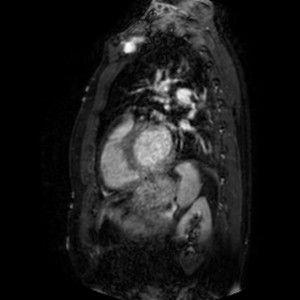</td>
<td>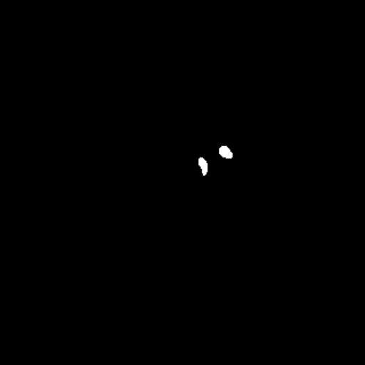</td>
<td>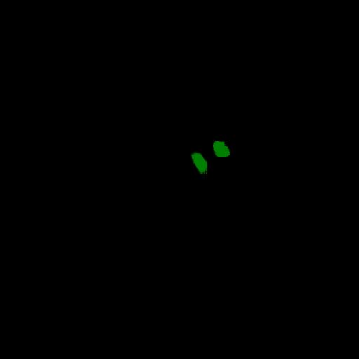</td>
</tr>

<tr>
<td>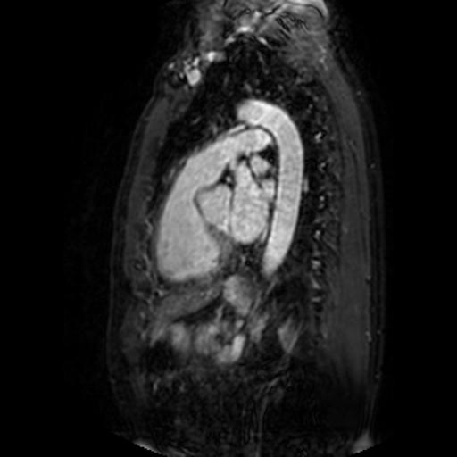</td>
<td></td>
<td></td>
</tr>

<tr>
<td>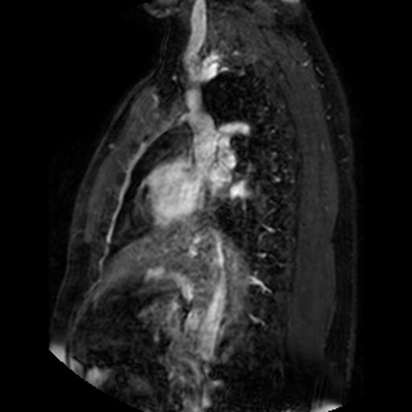</td>
<td></td>
<td></td>
</tr>
</table>

 
In this experiment, we used the simple UNet Model 
<a href="./src/TensorflowUNet.py">TensorflowSlightlyFlexibleUNet</a> for this Left-AtrialSegmentation Model. 
As shown in <a href="https://github.com/sarah-antillia/Tensorflow-Image-Segmentation-API">Tensorflow-Image-Segmentation-API</a>.
you may try other Tensorflow UNet Models: 

<li><a href="./src/TensorflowSwinUNet.py">TensorflowSwinUNet.py</a></li>
<li><a href="./src/TensorflowMultiResUNet.py">TensorflowMultiResUNet.py</a></li>
<li><a href="./src/TensorflowAttentionUNet.py">TensorflowAttentionUNet.py</a></li>
<li><a href="./src/TensorflowEfficientUNet.py">TensorflowEfficientUNet.py</a></li>
<li><a href="./src/TensorflowUNet3Plus.py">TensorflowUNet3Plus.py</a></li>
<li><a href="./src/TensorflowDeepLabV3Plus.py">TensorflowDeepLabV3Plus.py</a></li>

 

<h3>1. Dataset Citation</h3>
The dataset used here has been derived from the following web site: 

<a href="https://www.kaggle.com/datasets/adarshsng/heart-mri-image-dataset-left-atrial-segmentation">
<b>
Heart MRI Image DataSet : Left Atrial Segmentation
</b>
</a>
  
<b>About Dataset</b> 
<b>Left Atrial Segmentation Challenge</b> 
Authors: Catalina Tobon-Gomez (catactg@gmail.com) and Arjan Geers (ajgeers@gmail.com) 
 
<b>About</b> 

This repository is associated with the Left Atrial Segmentation Challenge 2013 (LASC'13). LASC'13 was part of 
the STACOM'13 workshop, held in conjunction with MICCAI'13. Seven international research groups, 
comprising 11 algorithms, participated in the challenge.
 
For a detailed report, please refer to:

Tobon-Gomez C, Geers AJ, Peters, J, Weese J, Pinto K, Karim R, Ammar M, Daoudi A, Margeta J, Sandoval Z,  
Stender B, Zheng Y, Zuluaga, MA, Betancur J, Ayache N, Chikh MA, Dillenseger J-L, Kelm BM, Mahmoudi S,  
Ourselin S, Schlaefer A, Schaeffter T, Razavi R, Rhode KS. 
 Benchmark for Algorithms Segmenting the Left Atrium From 3D CT and MRI Datasets. 
  IEEE Transactions on Medical Imaging, 34(7):1460–1473, 2015.
 
 
<b>
License</b> 
<a href="https://commission.europa.eu/legal-notice_en">
EU ODP Legal Notice
</a>
 
<h3>
<a id="2">
2 Left-Atrial ImageMask Dataset
</a>
</h3>
 If you would like to train this Left-Atrial Segmentation model by yourself,
 please download our 512x512 pixels dataset from the google drive  
<a href="https://drive.google.com/file/d/1VAySrFfcHS9LwqfdId-nL7pt03eLV9tm/view?usp=sharing">
Left-Atrial-ImageMask-Dataset.zip</a>
, expand the downloaded ImageMaskDataset and put it under <b>./dataset</b> folder to be
<pre>
./dataset
└─Left-Atrial
    ├─test
    │   ├─images
    │   └─masks
    ├─train
    │   ├─images
    │   └─masks
    └─valid
        ├─images
        └─masks
</pre>
 
On the derivation of this dataset, please refer to the following Python scripts: 
<li><a href="./generator/ImageMaskDatasetGenerator.py">ImageMaskDatasetGenerator.py</a></li>
<li><a href="./generator/split_master.py">split_master.py.</a></li>
 
 
<b>Left-Atrial Statistics</b> 
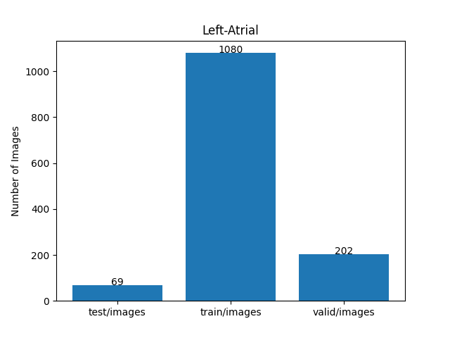 
 
As shown above, the number of images of train and valid datasets is not enough to use for a training set of our segmentation model.
 
 
<b>Train_images_sample</b> 
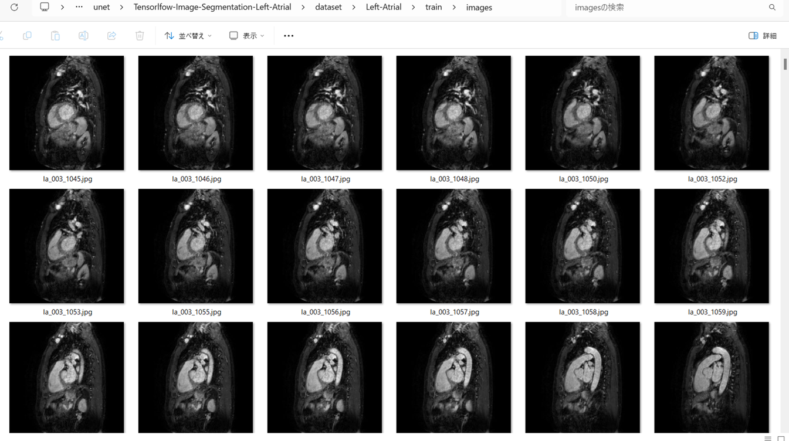
 
<b>Train_masks_sample</b> 
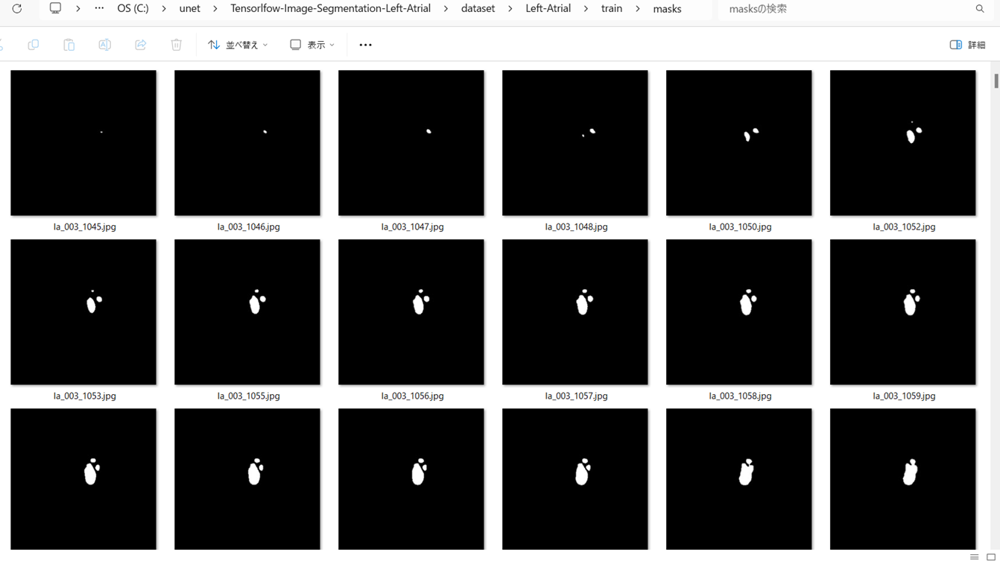
 

<h3>
3 Train TensorflowUNet Model
</h3>
 We trained Left-Atrial TensorflowUNet Model by using the following
<a href="./projects/TensorflowSlightlyFlexibleUNet/Left-Atrial/train_eval_infer.config"> <b>train_eval_infer.config</b></a> file.  
Please move to ./projects/TensorflowSlightlyFlexibleUNet/Left-Atrialand run the following bat file. 
<pre>
>1.train.bat
</pre>
, which simply runs the following command. 
<pre>
>python ../../../src/TensorflowUNetTrainer.py ./train_eval_infer.config
</pre>

<b>Model parameters</b> 
Defined a small <b>base_filters</b> and large <b>base_kernels</b> for the first Conv Layer of Encoder Block of 
<a href="./src/TensorflowUNet.py">TensorflowUNet.py</a> 
and a large num_layers (including a bridge between Encoder and Decoder Blocks).
<pre>
[model]
base_filters   = 16
base_kernels   = (9,9)
num_layers     = 8
dilation       = (3,3)
</pre>

<b>Learning rate</b> 
Defined a small learning rate.  
<pre>
[model]
learning_rate  = 0.00007
</pre>

<b>Online augmentation</b> 
Enabled our online augmentation tool. 
<pre>
[model]
model         = "TensorflowUNet"
generator     = True
</pre>

<b>Loss and metrics functions</b> 
Specified "bce_dice_loss" and "dice_coef". 
<pre>
[model]
loss           = "bce_dice_loss"
metrics        = ["dice_coef"]
</pre>
<b >Learning rate reducer callback</b> 
Enabled learing_rate_reducer callback, and a small reducer_patience.
<pre> 
[train]
learning_rate_reducer = True
reducer_factor     = 0.4
reducer_patience   = 4
</pre>

<b>Early stopping callback</b> 
Enabled early stopping callback with patience parameter.
<pre>
[train]
patience      = 10
</pre>

<b>Epoch change inference callbacks</b> 
Enabled epoch_change_infer callback. 
<pre>
[train]
epoch_change_infer       = True
epoch_change_infer_dir   =  "./epoch_change_infer"
epoch_changeinfer        = False
epoch_changeinfer_dir    = "./epoch_changeinfer"
num_infer_images         = 6
</pre>

By using this epoch_change_infer callback, on every epoch_change, the inference procedure can be called
 for 6 images in <b>mini_test</b> folder. This will help you confirm how the predicted mask changes 
 at each epoch during your training process.    

<b>Epoch_change_inference output at starting (1,2,3)</b> 
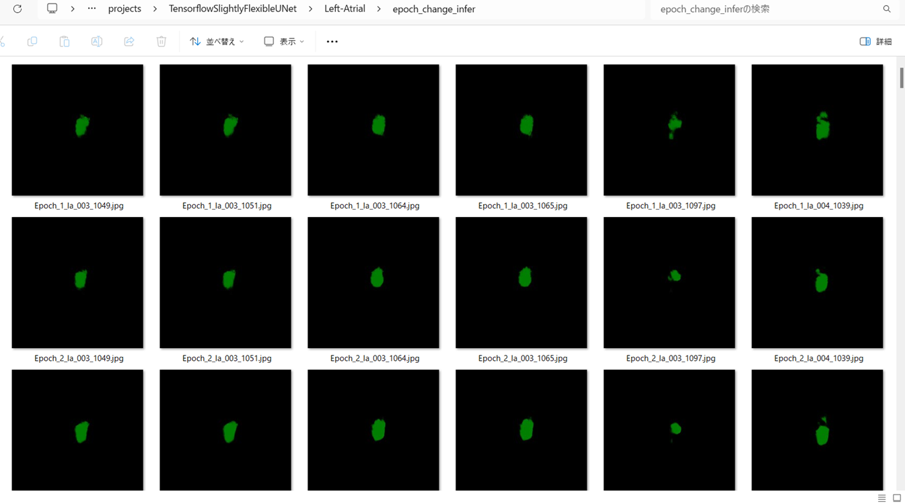 
 
<b>Epoch_change_inference output at ending (93,94,95)</b> 
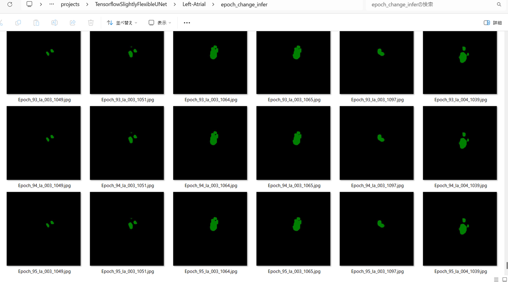 
 

In this experiment, the training process was stopped at epoch 95  by EarlyStopping Callback.  
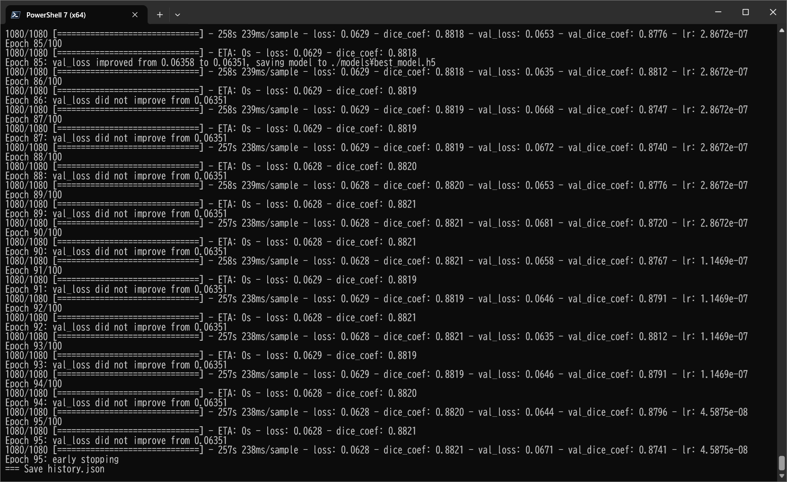 
 

<a href="./projects/TensorflowSlightlyFlexibleUNet/Left-Atrial/eval/train_metrics.csv">train_metrics.csv</a> 
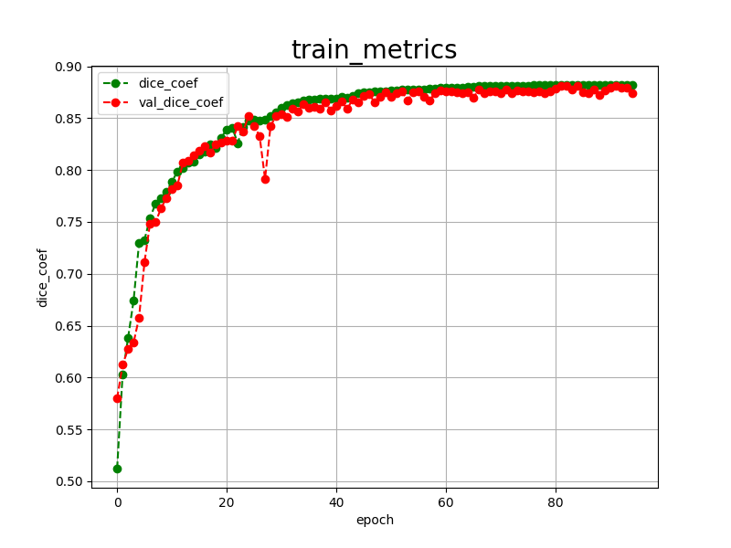 

 
<a href="./projects/TensorflowSlightlyFlexibleUNet/Left-Atrial/eval/train_losses.csv">train_losses.csv</a> 
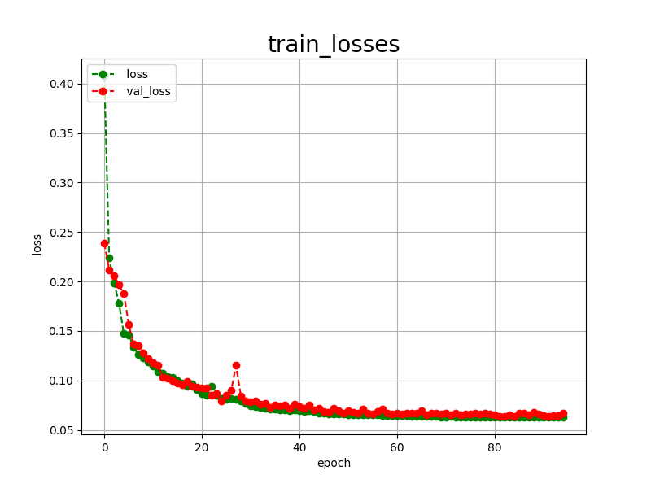 
 

<h3>
4 Evaluation
</h3>
Please move to a <b>./projects/TensorflowSlightlyFlexibleUNet/Left-Atrial</b> folder, 
and run the following bat file to evaluate TensorflowUNet model for Left-Atrial. 
<pre>
./2.evaluate.bat
</pre>
This bat file simply runs the following command.
<pre>
python ../../../src/TensorflowUNetEvaluator.py ./train_eval_infer_aug.config
</pre>
Evaluation console output: 
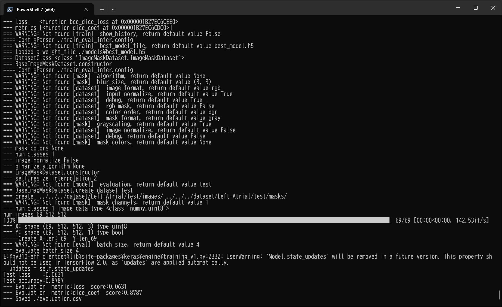
  Image-Segmentation-Left-Atrial

<a href="./projects/TensorflowSlightlyFlexibleUNet/Left-Atrial/evaluation.csv">evaluation.csv</a> 
The loss (bce_dice_loss) to this Left-Atrial/test was low, but dice_coef not so high as shown below.
 
<pre>
loss,0.0631
dice_coef,0.8787
</pre>
 
<h3>5 Inference</h3>
Please move to a <b>./projects/TensorflowSlightlyFlexibleUNet/Left-Atrial</b> folder 
,and run the following bat file to infer segmentation regions for images by the Trained-TensorflowUNet model for Left-Atrial. 
<pre>
./3.infer.bat
</pre>
This simply runs the following command.
<pre>
python ../../../src/TensorflowUNetInferencer.py ./train_eval_infer_aug.config
</pre>

<b>mini_test_images</b> 
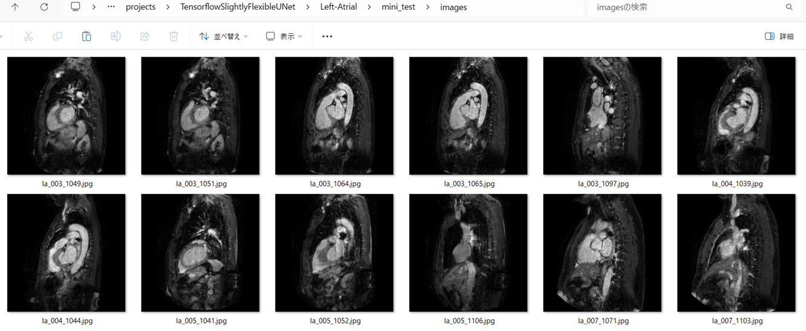 
<b>mini_test_mask(ground_truth)</b> 
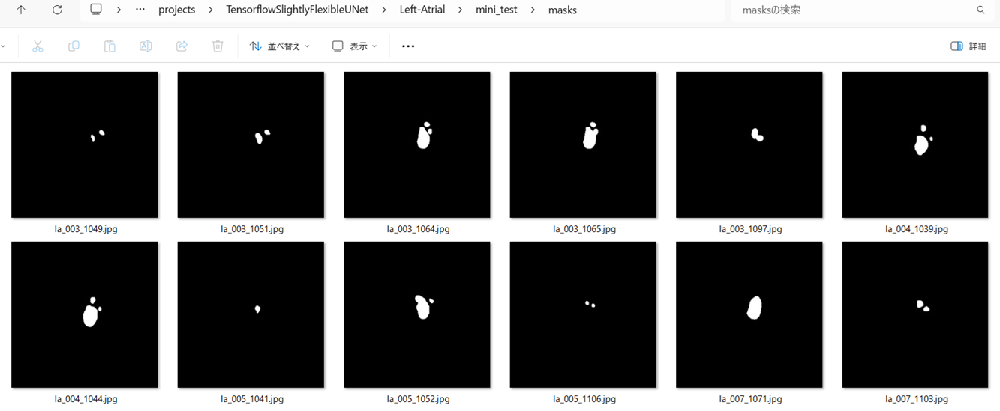 

<b>Inferred test masks</b> 
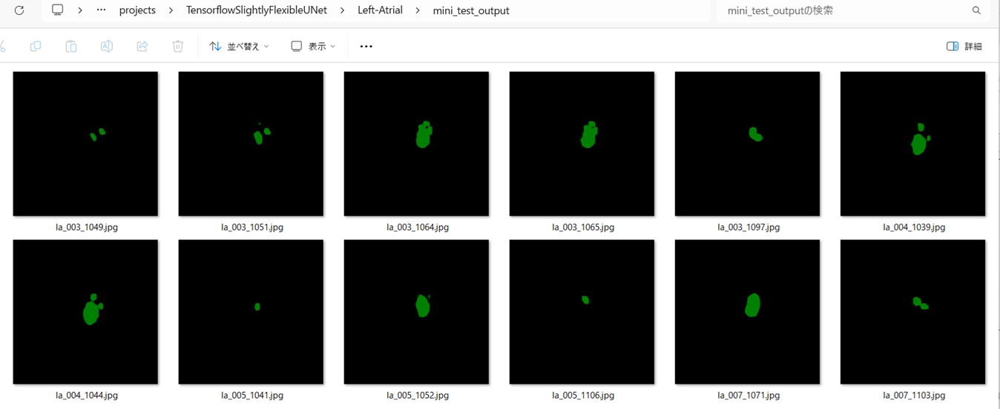 

 

<b>Enlarged images and masks </b> 

<table>
<tr>
<th>Image</th>
<th>Mask (ground_truth)</th>
<th>Inferred-mask</th>
</tr>

<tr>
<td></td>
<td></td>
<td></td>
</tr>

<tr>
<td></td>
<td>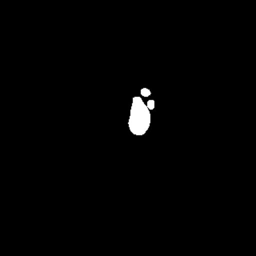</td>
<td>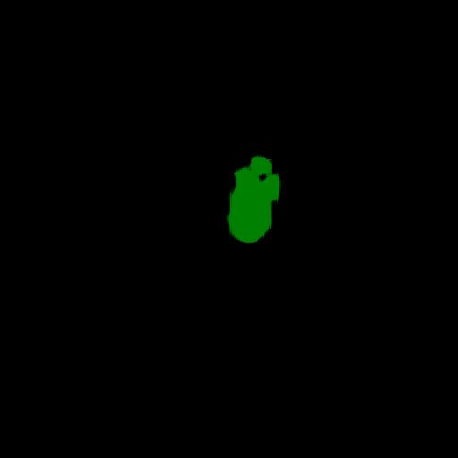</td>
</tr>

<tr>
<td>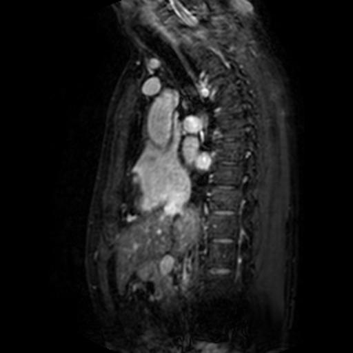</td>
<td></td>
<td></td>
</tr>
<tr>
<td>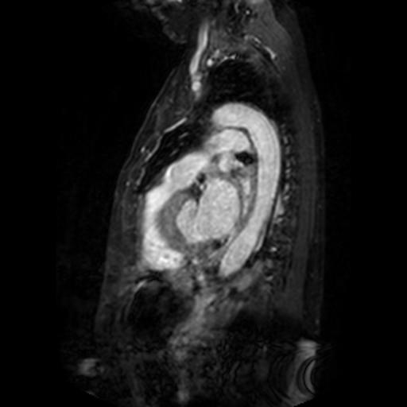</td>
<td>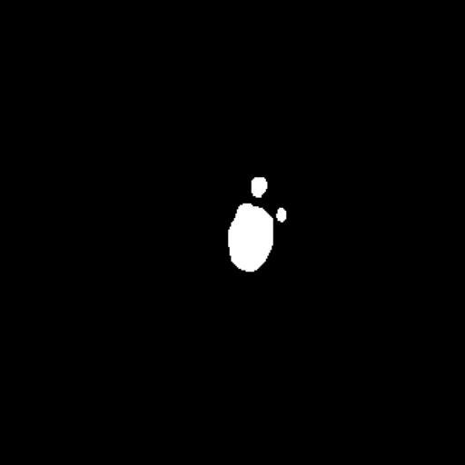</td>
<td>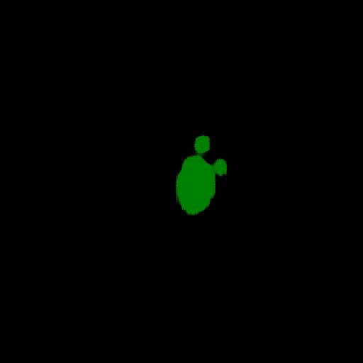</td>
</tr>
<tr>
<td>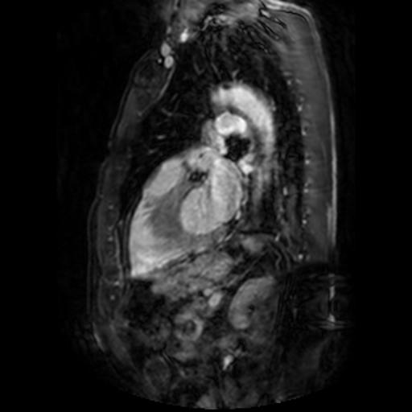</td>
<td></td>
<td></td>
</tr>
<tr>
<td>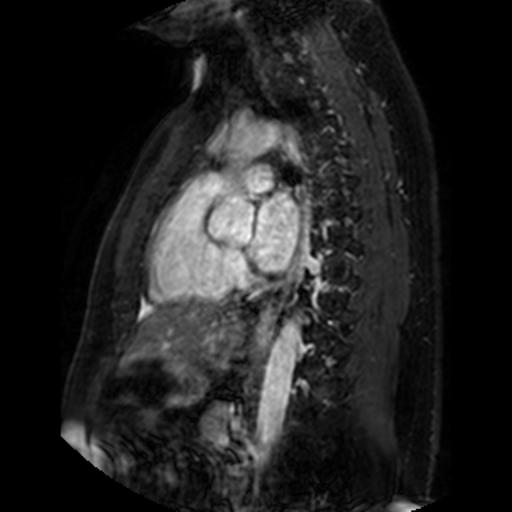</td>
<td></td>
<td></td>
</tr>
</table>

 

<h3>
References
</h3>
<b>1. Deep Learning for Cardiac Image Segmentation: A Review</b> 
Chen Chen, Chen Qin, Huaqi Qiu, Giacomo Tarroni,Jinming Duan,Wenjia Bai, Daniel Rueckert 

<a href="https://www.frontiersin.org/journals/cardiovascular-medicine/articles/10.3389/fcvm.2020.00025/full">
https://www.frontiersin.org/journals/cardiovascular-medicine/articles/10.3389/fcvm.2020.00025/full</a>
 
 
<b>2. Medical Image Analysis on Left Atrial LGE MRI for Atrial Fibrillation Studies: A Review</b>
 
Lei Li, Veronika A Zimmer, Julia A Schnabel, Xiahai Zhuang 
<a href="https://pmc.ncbi.nlm.nih.gov/articles/PMC7614005/">https://pmc.ncbi.nlm.nih.gov/articles/PMC7614005/</a>

 
 
<b>3. A Two-stage Method with a Shared 3D U-Net for Left Atrial Segmentation of Late Gadolinium-Enhanced MRI Images</b>
 
Jieyun Bai, Ruiyu Qiu, Jianyu Chen, Liyuan Wang, Lulu Li, Yanfeng Tian, Huijin Wang, Yaosheng Lu, Jichao Zhao
 
<a href="https://www.scienceopen.com/hosted-document?doi=10.15212/CVIA.2023.0039">
https://www.scienceopen.com/hosted-document?doi=10.15212/CVIA.2023.0039</a>
 
 
<b>4. Heart Segmentation — Neural Networks for Medical Imaging</b> 
Matheus Ramos Parracho 
<a href="https://medium.com/@mathparracho/heart-segmentation-neural-networks-for-medical-imaging-a75138906ed1">
https://medium.com/@mathparracho/heart-segmentation-neural-networks-for-medical-imaging-a75138906ed1</a>

 
 
<b>5. Fully Automated 3D Cardiac MRI Localisation and Segmentation Using Deep Neural Networks </b> 
Sulaiman Vesa, Andreas Maier, Nishant Ravikumar 
<a href="https://pmc.ncbi.nlm.nih.gov/articles/PMC8321054/">https://pmc.ncbi.nlm.nih.gov/articles/PMC8321054/</a>

 

